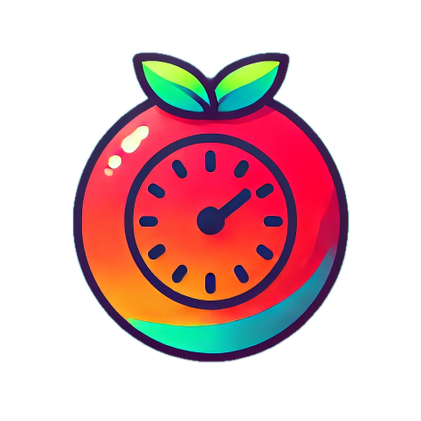
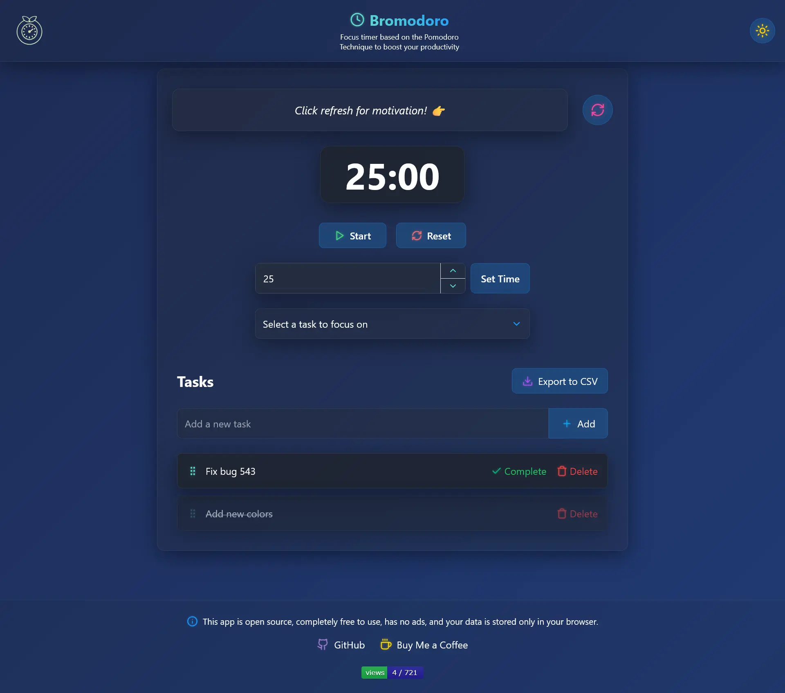
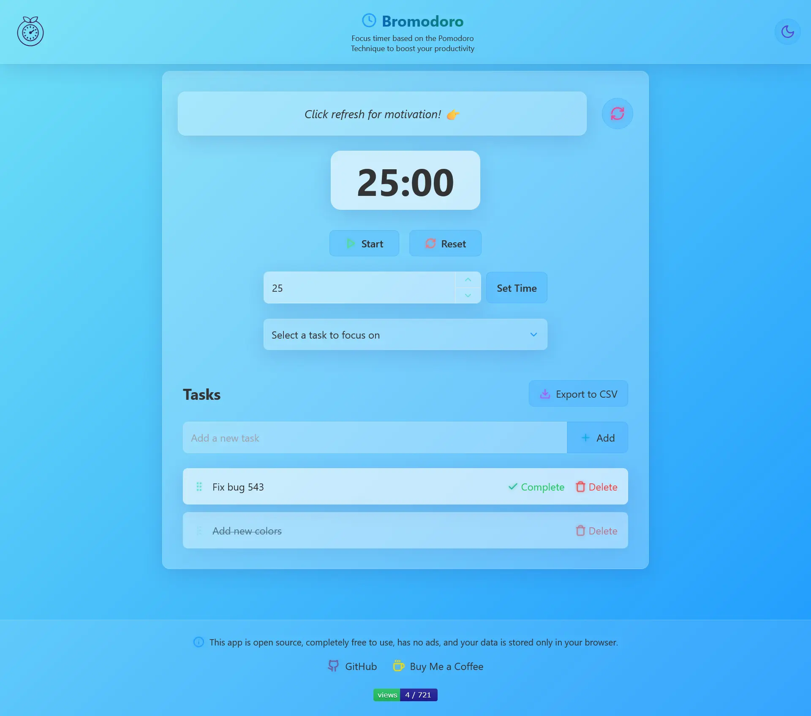

# Bromodoro

👉 **[Try Bromodoro Now!](https://www.bromodoro.live)**

  


**Bromodoro** is a simple, elegant, and easy-to-use Pomodoro Timer app designed to boost your productivity. It’s free to use, ad-free, and doesn’t require any login. All your data is stored locally in your browser, ensuring complete privacy.

---

## What is the Pomodoro Technique? 🕒

The Pomodoro Technique is a time management method that breaks work into intervals (traditionally 25 minutes) separated by short breaks.

The Pomodoro Technique can help maintain and improve focus, reduce procrastination, prevent burnout and increase overall productivity. 

1. **Choose a Task**: Select a task to focus on. 
3. **Work**: Focus on the task without distractions until the timer goes off. 
2. **Set the Timer**: Set a timer for 25 minutes. 
4. **Take a Break**: Take a 5-minute break. 
5. **Repeat**: Repeat steps 1-4 three more times. 
6. **Longer Break**: After four pomodoros, take a longer break of 15-30 minutes. 

---

## Features ✨

- **Pomodoro Timer**: Set a 25-minute timer (or customize it) to focus on your tasks.
- **Task Management**: Add, delete, and mark tasks as completed.
- **Auto-Mark Completed**: When the timer ends, the selected task is automatically marked as completed.
- **Customizable Timer**: Set your own timer duration in minutes.
- **Simple & Clean UI**: Beautiful and intuitive design for a seamless experience.
- **No Login Required**: Use the app without creating an account.
- **Local Storage**: All your tasks and settings are stored in your browser—no external servers involved.
- **LLM Integration**: Get motivated with LLM generated motivational quotes. 
- **Export to CSV**: You can export the task list as a CSV anytime, with a timestamped filename.

---

## How to Use 🚀

1. **Set the Timer**: Keep the default 25-minute timer or set a custom time.
2. **Add Tasks**: Create a list of tasks you want to work on.
3. **Select a Task**: Choose a task to focus on during the timer.
4. **Start Working**: Click "Start" and focus until the timer ends.
5. **Auto-Complete**: When the timer ends, the selected task is marked as completed automatically.
6.  **Export to CSV**: Click on the "Export to CSV" button to export the task list as a CSV anytime, with a timestamped filename.
7. **Motivation**: Click the refresh button beside the quote box to generate a new motivational quote.

---

## Screenshots 📸

<div style="display: flex; gap: 10px;">
  
  
</div>


---

## Why Bromodoro? 🌟

- **Free**: No hidden costs or subscriptions.
- **No Ads**: Enjoy a distraction-free experience.
- **Privacy-First**: Your data stays in your browser—no tracking, no sharing.
- **Easy to Use**: Designed for simplicity and productivity.


---

## Tech Stack 🛠️

- **Frontend**: Next.js, React, Tailwind CSS
- **State Management**: React Context API
- **Local Storage**: Browser’s local storage for data persistence

---

## Contributing 🤝

Contributions are welcome! Feel free to open an issue or submit a pull request.


---

## Credits 🙏

Built with ❤️ by codeslord. Inspired by the Pomodoro Technique.

---

**Start focusing, stay productive, and achieve more with Bromodoro!** 🍅

---

## Installation & Setup 💻

This is a [Next.js](https://nextjs.org) project bootstrapped with [`create-next-app`](https://nextjs.org/docs/app/api-reference/cli/create-next-app).

## Getting Started

First, run the development server:

```bash
npm run dev
# or
yarn dev
# or
pnpm dev
# or
bun dev
```

Open [http://localhost:3000](http://localhost:3000) with your browser to see the result.

You can start editing the page by modifying `app/page.tsx`. The page auto-updates as you edit the file.

This project uses [`next/font`](https://nextjs.org/docs/app/building-your-application/optimizing/fonts) to automatically optimize and load [Geist](https://vercel.com/font), a new font family for Vercel.

## Learn More

To learn more about Next.js, take a look at the following resources:

- [Next.js Documentation](https://nextjs.org/docs) - learn about Next.js features and API.
- [Learn Next.js](https://nextjs.org/learn) - an interactive Next.js tutorial.

You can check out [the Next.js GitHub repository](https://github.com/vercel/next.js) - your feedback and contributions are welcome!

## Deploy on Vercel

The easiest way to deploy your Next.js app is to use the [Vercel Platform](https://vercel.com/new?utm_medium=default-template&filter=next.js&utm_source=create-next-app&utm_campaign=create-next-app-readme) from the creators of Next.js.

Check out our [Next.js deployment documentation](https://nextjs.org/docs/app/building-your-application/deploying) for more details.
